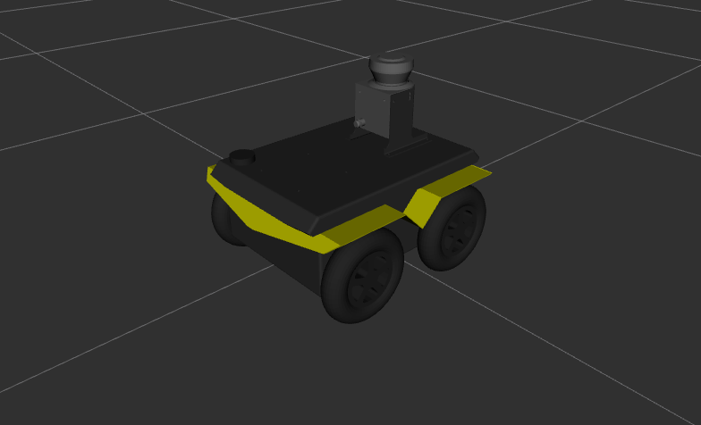
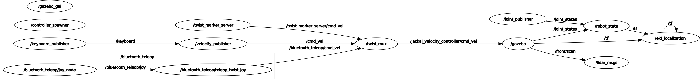
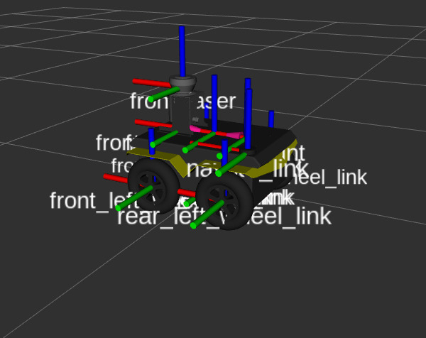
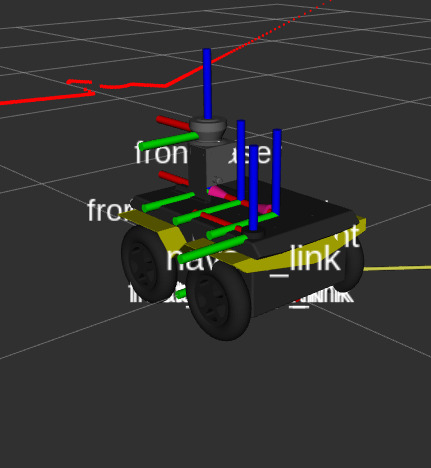
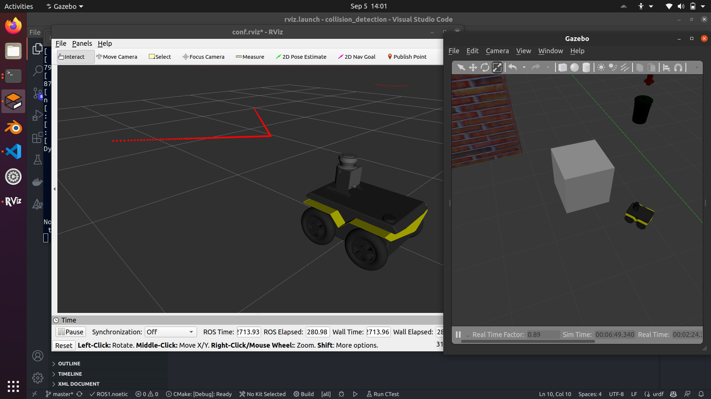

# Collision Detection for UGV



## Intro 

Attempting to create a robust collision detection system for ugv using LiDAR and IMU data. <br>
Locomotion for rover using WASD keys. <br>

UGV reference : [Jackal](https://docs.ros.org/en/noetic/api/jackal_tutorials/html/simulation.html) <br>

1. For visualizing model and lidar data in rviz : 
```bash
roslaunch collision_detection rviz.launch
```

2. For launching the simulation : 
The rover can be controlled using keyboard, **W, A, S, D** keys.

```bash
roslaunch collision_detection race_track.launch
```
3. For launching the Collision Detector
```bash
rosrun collision_detection collision_dectetor.py
```

### Design and Future Scope

1. Attempt 1: Only Using LiDAR Information, 2D lidar was used for getting distances of nearby objects, a virtual bounding cylinder (**Body field**) which encompasses the entire model was made, if distance of nearest object<**radius** of the cylinder, then **collision**. The Body field is represented using `sensor_msgs/LaserScan` message, which is an array of ranges. The Linear search for collision was achived via multithreading for improving efficiency. <br>
Advantages :
    1. Precise data from LiDAR in the range (0.1m,30m). 

Disadvantages : <br>
    1. Large area of unoccupied space as cylinder shape is used as the Body field for a box.
    2. Use case : when the rover slowly goes and touches an object, the detector will ping collision.
    3. Relatively slow as it involves linear search.

Future attempts will be based on IMU data by tracking drastic changes in individual components of Linear acceleration, Angular acceleration, angular velocity and orientation of the rover. This will like result in faster detection and will be able to measure and rank collisions to estimate the damage in real time situations.

## System

ROS version : Noetic <br>
Distro : Ubuntu 20.04 <br>
Gazebo Version : 11.13.0

### Dependencies 

- Jackal simulator : Model of UGV with plugins and sensors like LiDAR, imu, encoders etc..
- Joy package
- pynput python module
- threading python module

#### Run for installation: 
```
sudo apt install ros-noetic-jackal-simulator ros-noetic-joy ros-noetic-jackal-desktop
pip3 install pynput
pip3 install threading
``` 
---

## Nodes and functionality

1. teleop_key.py - captures keyboard events and publishes them.
2. cmd_vel.py - subscribes to the keyboard events and publishes to /cmd_vel topic for control of the rover.
3. collision_detector.py - Detects collision based on lidar sensor data.



### ROBOT Summary : 
1. Mass : 18.70 kg.
2. Dimensions : 0.43m x 0.43m X 0.18m.
3. Sensors : LiDAR, Inertial Measurement Unit, Wheel encoders.



<br>



<br>

